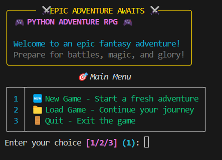

# 🎮 Python Adventure RPG ⚔️

<div align="center">

**A comprehensive terminal-based fantasy RPG built in Python using the `rich` library.**



</div>

---

## ✨ Overview

**Python Adventure RPG** is a feature-rich text-based terminal RPG that combines classic gameplay mechanics with modern terminal UI. Create your character, choose from three distinct classes, battle diverse monsters with unique abilities, level up with skill allocation, shop for equipment and potions, and save your progress in this complete adventure experience.

---

## 🚀 Complete Feature Set

### 🎨 Rich Terminal UI
* **Stunning Visual Interface**: Uses the `rich` library for colored text, tables, panels, progress bars, and animations
* **Dynamic Status Displays**: Real-time HP/Mana/XP bars with visual indicators
* **Immersive Combat Interface**: Detailed battle status with threat indicators and visual feedback
* **Interactive Menus**: Intuitive navigation throughout the game

### 🧙 Advanced Character System
* **Three Distinct Classes**: 
  - **⚔️ Warrior**: High HP/Attack with 10% damage reduction and Mighty Slash
  - **🔮 Mage**: Powerful magic with 15% mana efficiency and Fireball
  - **🗡️ Rogue**: Balanced stats with +5% critical chance and Sneak Attack
* **Skill Point System**: Allocate points to Strength, Vitality, Intelligence, and Agility
* **Equipment System**: Weapons and armor with stat bonuses that scale with level
* **Character Statistics**: Track monsters defeated, battles won/lost, potions used, and more

### ⚔️ Strategic Combat System
* **Turn-Based Battles**: Six combat actions including attack, special abilities, potions, defend, and escape
* **Special Abilities**: Class-specific attacks with cooldowns and mana costs
* **Combat Mechanics**: Critical hits (10% base chance), dodging (15% chance), and defending
* **Status Effects**: Various buffs and debuffs affecting combat flow

### 👹 Diverse Monster System
* **8 Monster Types**: Goblins, Orcs, Skeletons, Wolves, Bandits, Trolls, Dark Knights, and Dragon Whelps
* **Boss Monsters**: Ancient Lich, Crimson Dragon, and Void Wraith with devastating abilities
* **Rarity System**: Common, Uncommon, Rare, and Legendary monsters with different rewards
* **Special Abilities**: Each monster type has unique abilities like sneak attacks, regeneration, and fire breath
* **Dynamic Scaling**: Monster stats scale with player level for consistent challenge

### 📈 Comprehensive Progression
* **Level System**: Gain XP from battles to level up and increase all stats
* **Skill Trees**: Four skill categories that permanently enhance your character
* **Equipment Progression**: Weapons and armor unlock at different level tiers
* **Stat Tracking**: Detailed statistics of your adventure progress

### 🏪 Advanced Shop System
* **Dynamic Pricing**: Potion and equipment prices scale with your level
* **Equipment Store**: Weapons and armor with attack/HP bonuses available at different level requirements
* **Selling System**: Sell unused potions and equipment for gold
* **Shopkeeper Dialogue**: Context-aware greetings based on your gold and level

### 💾 Complete Save System
* **Multiple Save Slots**: Create and manage multiple named save files
* **JSON Format**: Human-readable save files with all character data
* **Auto-Directory Creation**: Automatically creates `saves/` directory
* **Load/Overwrite Protection**: Confirmation prompts for overwriting existing saves

### 🎯 Quality of Life Features
* **Escape Mechanics**: 30% chance to flee from any battle
* **Potion Usage**: Use potions in combat or from the main menu
* **Visual Feedback**: Comprehensive status displays and progress indicators
* **Error Handling**: Robust input validation and error messages

---

## 🛠️ Installation

### Requirements
* Python 3.7+
* A terminal that supports ANSI colors

### Setup
```bash
git clone https://github.com/your-username/python-adventure-rpg.git
cd python-adventure-rpg
pip install rich
python main.py
```

---

## 🎮 How to Play

### Character Creation
1. Enter your character's name
2. Choose from three classes:

| Class      | Base Stats           | Passive Ability        | Special Attack |
|------------|---------------------|------------------------|----------------|
| ⚔️ Warrior | 100 HP, 30 Mana, 20 ATK | 10% Damage Reduction   | Mighty Slash   |
| 🔮 Mage    | 80 HP, 60 Mana, 15 ATK  | 15% Mana Efficiency    | Fireball       |
| 🗡️ Rogue   | 90 HP, 45 Mana, 18 ATK  | +5% Critical Chance    | Sneak Attack   |

### Main Game Loop
* **⚔️ Fight Monsters**: Battle scaled enemies with unique abilities
* **🏪 Visit Shop**: Buy weapons, armor, and potions
* **🧪 Use Potions**: Heal HP or restore mana outside of combat
* **📊 Character Info**: View detailed stats, equipment, and skill allocations
* **💾 Save/Load**: Manage multiple save files
* **🚪 Quit**: Exit the game

### Combat System
Choose from six actions each turn:
1. **Regular Attack**: Basic damage with 10% critical hit chance
2. **Special Attack**: High-damage class ability (requires mana, has cooldown)
3. **Use Health Potion**: Restore HP and skip enemy turn
4. **Use Mana Potion**: Restore mana and skip enemy turn
5. **Defend**: Reduce incoming damage by 50%
6. **Try to Escape**: 30% chance to flee the battle

### Character Development
* **Level Up**: Gain XP from victories to increase base stats and earn skill points
* **Skill Allocation**: Invest points in four attributes:
  - **Strength**: +2 Attack per point
  - **Vitality**: +10 HP per point
  - **Intelligence**: +8 Mana per point
  - **Agility**: +1 Special Damage per point
* **Equipment**: Purchase and equip weapons and armor for stat bonuses

### Monster Encounters
* **Regular Monsters**: 8 different types with unique descriptions and abilities
* **Rarity System**: Higher rarity monsters provide better rewards
* **Boss Battles**: 5% chance for boss encounters at level 5+ with legendary rewards
* **Special Abilities**: Monsters use unique attacks like regeneration, fire breath, and life drain

### Shop Features
* **Scaling Economy**: Prices and effects increase with your level
* **Equipment Tiers**: New weapons and armor unlock as you level up
* **Selling Items**: Convert unused items back to gold
* **Dynamic Dialogue**: Shopkeeper responses change based on your status

---

## 📁 Project Structure

```
python-adventure-rpg/
├── main.py          # Entry point
├── game.py          # Main game loop and menu system
├── player.py        # Player class with stats, skills, and equipment
├── monsters.py      # Monster classes and encounter system
├── combat.py        # Turn-based combat mechanics
├── shop.py          # Shopping system with equipment and potions
├── utils.py         # Utility functions and helpers
├── saves/           # Auto-created directory for save files
└── README.md        # This documentation
```

---

## 🎯 Technical Highlights

* **Object-Oriented Design**: Clean class hierarchy with abstract base classes
* **Rich Terminal UI**: Leverages the `rich` library for professional-looking terminal interface
* **Flexible Monster System**: Easy to extend with new monster types and abilities
* **Robust Save System**: JSON-based saves with backward compatibility
* **Scalable Progression**: All systems scale appropriately with player level
* **Error Handling**: Comprehensive input validation and graceful error recovery

---

## 🤝 Contributing

This project is complete and no longer accepting contributions. Feel free to fork it for your own modifications.

---

## 📄 License

MIT License. See LICENSE for details.

---

**Enjoy your adventure! ⚔️✨**